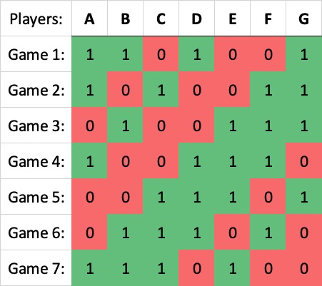

# Mario Kart Tournament Scheduler
[See it live here](https://mkts.ethanr.co.uk)

A simple web app that schedules a Mario Kart (or other game) tournament from a list of names,
in an effort to be short, while being as fair as possible.

If the players were willing, they could play all possible combinations of players. However, even 7 players with 4 per game would involve 35 games total. This is impractical.
This web app aims to outline a tournament with the same number of games as players (e.g. 7 players, with 7 games total), while maintaining fairness as much as possible. 

Fairness is defined as being as close as possible to the following 2 criterion:
1) Everyone plays the same amount of games
2) Everyone plays every other person the same amount of times
3) Everyone's games are spread out across the session

The first criterion has been prioritised to **always** be true.
However, it is not always possible for every player to play every other the same number of times.

The algorithm that was created works by generating a *"**kernel**"* for the first game, then "rotating" through the players.
By generating the kernel in different ways, you can change the distribution of games. 

It was found that by spacing the games out using triangle numbers (0,1,3,6,10,etc), games were optimal. This is because it covers every possible "spacing" between players.

For example, in the image above, game 1 has the 0th, 1st, 3rd and 6th players. Following games simply rotate the previous games by 1.

In cases where the number of players is not a triangle number, the kernel must be padded with 0s.
